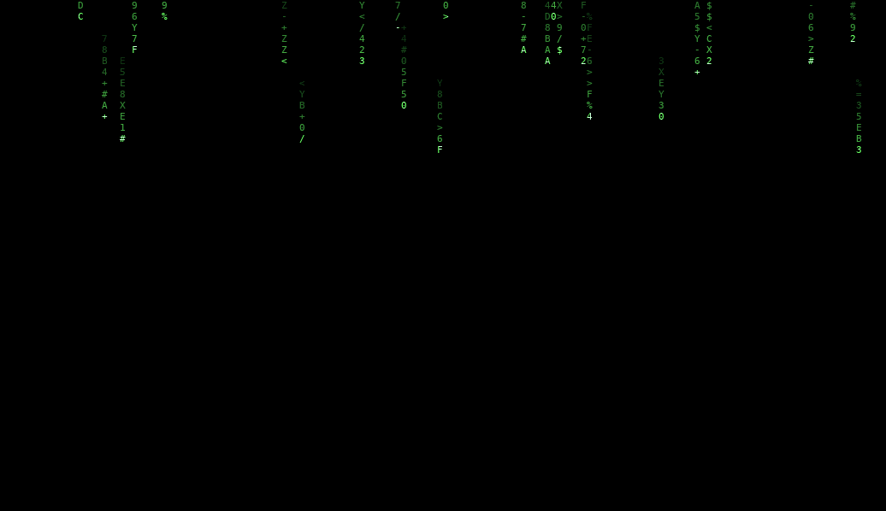

I build tools that turn messy data into something people can inspect, question and use.

Third-year Electronics & Telecommunication student, Army Institute of Technology, Pune. Smart India Hackathon National Finalist · Reliance Foundation Undergraduate Scholar.

**Open to paid software engineering and data analyst internships.**

  

## Projects

| Project | Focus |
| :-- | :-- |
| [District Health Access Lab](https://github.com/pradyodhp/district-health-access-lab) | An evidence-first health-access work sample: trace the data, test assumptions and explain what a model can and cannot support. Scenarios are hypothetical; real funding decisions remain on hold until the required evidence is verified. |
| Marketwatchdawg (private) | Stock-anomaly review prototype with explainable alerts and a web dashboard. Synthetic demo data; not investment advice. |
| [YatraMind](https://github.com/pradyodhp/YatraMind) | Team project exploring train-induction planning and operations decision support for Kochi Metro. |
| [DecodX-LLM](https://github.com/pradyodhp/DecodX-LLM) | Document question answering with retrieval, BM25, FAISS and a FastAPI service. |
| [Calorie Calculator](https://github.com/pradyodhp/caloriecalculator) | Nutrition API integration, intake tracking and a responsive web interface. |

## Working toolkit

**Build:** Python, FastAPI, JavaScript, React  
**Analyse:** NumPy, simulation, sensitivity analysis  
**Retrieve & verify:** BM25, FAISS, pytest, Git

## Tools I build with

<picture>
  <source media="(prefers-color-scheme: dark)" srcset="https://skillicons.dev/icons?i=py,fastapi,react,js,ts,html,css,git&theme=dark" />
  
</picture>

### A little motion

<picture>
  <source media="(prefers-color-scheme: dark)" srcset="https://raw.githubusercontent.com/pradyodhp/pradyodhp/refs/heads/output/profile/snake-dark.svg?v=3" />
  
</picture>

Contribution snake generated daily from my GitHub activity.

  
  &nbsp;&nbsp;
  

---

Interested in software, analytics or a project collaboration? [Find me on GitHub](https://github.com/pradyodhp).
